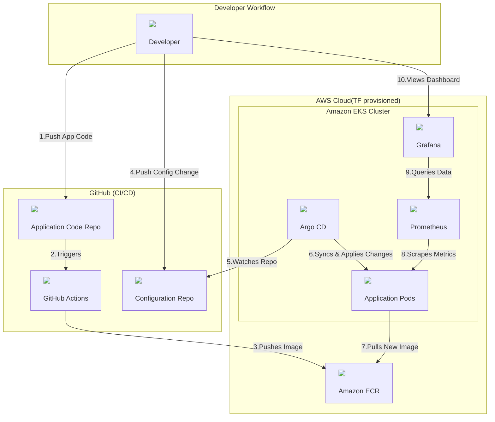

# Automated Microservices Platform on Kubernetes with GitOps

This project demonstrates a complete, production-style platform for deploying and monitoring containerized applications on AWS. It uses a fully automated CI/CD pipeline built on modern DevOps and GitOps principles. The entire infrastructure is provisioned as code, and application deployments are declarative and automatically reconciled from a Git repository.

## Project Status

**Status:** Complete

---

## Observability in Action: Grafana Dashboard

Below is a screenshot of a pre-configured Grafana dashboard, automatically deployed by the `kube-prometheus-stack` Helm chart. It displays real-time metrics scraped from the Kubernetes cluster, providing instant visibility into the health and performance of the running pods and nodes.

## Architecture Diagram

## Features & Core Concepts Demonstrated

-   **Infrastructure as Code (IaC):** The entire cloud environment, including the VPC and EKS Cluster, is provisioned and managed declaratively using **Terraform**.
-   **Automated CI Pipeline:** A **GitHub Actions** workflow automatically triggers on code changes to build, tag, and push Docker images to a private **AWS ECR** repository.
-   **GitOps Continuous Deployment:** **Argo CD** acts as the GitOps agent, automatically detecting changes in the deployment repository and synchronizing the application state to the Kubernetes cluster, ensuring Git is the single source of truth.
-   **Real-time Observability:** A full monitoring stack, deployed with **Helm**, uses **Prometheus** to scrape detailed metrics from the cluster and applications, which are then visualized in comprehensive **Grafana** dashboards.

## Technology Stack

| Category | Technology | Purpose |
| :--- | :--- | :--- |
| **Cloud Provider** | Amazon Web Services (AWS) | Hosting all infrastructure |
| **IaC** | Terraform | Provisioning the VPC and EKS Cluster |
| **Container Orchestration**| AWS EKS | Running the containerized application |
| **CI/CD Automation** | GitHub Actions | Building container images from source |
| **Container Registry**| AWS ECR | Storing private Docker images |
| **GitOps Agent** | Argo CD | Deploying applications from Git |
| **Monitoring** | Prometheus | Collecting metrics |
| **Visualization**| Grafana | Building and viewing dashboards |
| **Package Management**| Helm | Installing the Prometheus/Grafana stack |

## Project Stages

-   **Stage 1: Infrastructure Provisioning** ✅
    -   Defined the VPC, EKS cluster, and node groups using Terraform.
    -   Successfully deployed the foundational cloud infrastructure.
-   **Stage 2: Application Sourcing** ✅
    -   Forked the target microservices application to a personal repository.
-   **Stage 3: Continuous Integration (CI)** ✅
    -   Configured a secure OIDC connection between GitHub Actions and AWS.
    -   Built a workflow to automatically build and push container images to ECR.
-   **Stage 4: Continuous Deployment (CD)** ✅
    -   Installed and configured Argo CD on the Kubernetes cluster.
    -   Created a GitOps application to automatically deploy services from the `k8s-manifests` directory.
-   **Stage 5: Observability** ✅
    -   Deployed the `kube-prometheus-stack` using Helm.
    -   Accessed real-time cluster and application metrics via Grafana dashboards.

---

## Challenges Faced & Solutions

This project involved several real-world challenges that required troubleshooting and a deeper understanding of the tools.

### 1. Cross-Platform `kubectl` Quoting Issues
-   **Problem:** The `kubectl patch` command with a JSON string failed on Windows PowerShell due to differences in how it handles single and double quotes compared to Linux/macOS shells.
-   **Solution:** Instead of trying to find the correct escaping syntax for one specific shell, I switched to the more robust and platform-agnostic `kubectl edit svc/argocd-server -n argocd` command. This opens the live resource configuration in a local text editor, completely bypassing any shell interpretation issues. This is a more reliable method for quick, interactive changes.

### 2. Tooling Path Issues in VS Code's Integrated Terminal
-   **Problem:** The `helm` command was recognized in the standard Windows Command Prompt but failed with `"command not recognized"` inside the VS Code integrated terminal.
-   **Solution:** This indicated that VS Code was using a cached environment from before the `PATH` for Helm was updated. The fix was to force VS Code to reload its entire environment by using the Command Palette (`Ctrl+Shift+P`) and running the **`Developer: Reload Window`** command. This ensured the integrated terminal inherited the new, correct system `PATH`.

### 3. CI Workflow Not Triggering After a Fix
-   **Problem:** After fixing a syntax error in the GitHub Actions workflow file, the pipeline did not run on the next `git push`.
-   **Solution:** I realized this was not an error, but the `on.push.paths` filter working correctly. My commit only changed the workflow file itself (`.github/workflows/ci-pipeline.yml`), which did not match the filter `src/frontend/**`. To properly test the pipeline, I made a trivial change (added a comment) to a file inside the `src/frontend` directory. This commit matched the path filter and successfully triggered the CI workflow, confirming the logic was sound.

### 4. Argo CD Reporting "Resource Not Found"
-   **Problem:** After setting up the Argo CD application, the UI showed that the `frontend` Deployment was "missing" in the cluster and was not being deployed.
-   **Solution:** This was a problem with the "source of truth." I had forgotten to copy the `frontend.yaml` manifest into the `k8s-manifests` directory in my GitOps repository. As soon as I added the missing file and pushed the commit, Argo CD automatically detected the change and deployed the resource successfully. This was a perfect real-world demonstration of the core GitOps principle: the cluster state strictly follows the Git state.

---

## Project Cleanup

To avoid incurring AWS costs, the entire infrastructure created by this project can be destroyed with a single command.

**Instructions:**
1.  Navigate to the `/terraform` directory.
2.  Run the command: `terraform destroy --auto-approve`